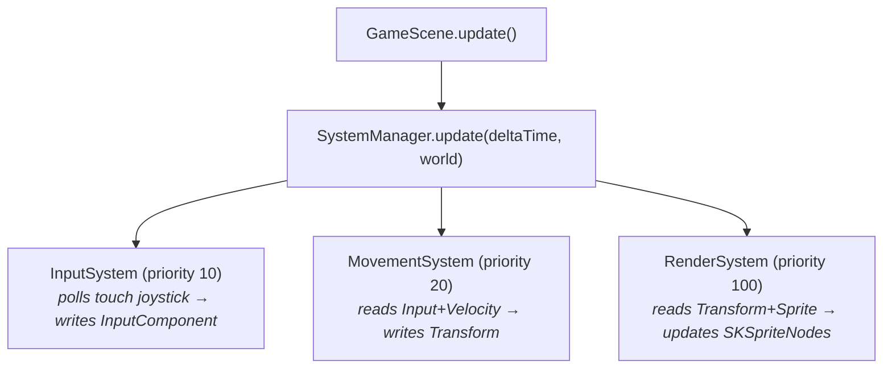

# Entity-Component-System (ECS)

The game is built on an **Entity-Component-System (ECS)** architecture, that prioritises composition over inheritance.

## Core Concepts

### Entity
An entity is a unique ID, like a database primary key. It does not contain any data or behaviour of its own. It is an identifier that holds a collection of **components**.

### Component
A component is a plain data container (e.g. a struct) attached to an entity. It holds state but no logic. Examples:

- `TransformComponent` — stores x/y coordinates and direction
- `HealthComponent` — stores current and max HP
- `VelocityComponent` — stores movement vector

See: [Components](./component.md)

### System
A system contains the logic. Systems iterate over all entities, for those that have a specific set of components, they process them and update the components. Examples:

- `MovementSystem` — reads `VelocityComponent`, writes `PositionComponent`
- `RenderSystem` — reads `PositionComponent`, draws the entity on screen
- `CombatSystem` — reads `HealthComponent`, applies damage

See: [Systems](./system.md)

## Why ECS?

| Approach | Problem |
|---|---|
| Deep inheritance | Fragile, hard to mix behaviours |
| ECS composition | Add/remove components freely at runtime |

ECS makes it easy to add new behaviours (e.g. a "poisoned" status) by simply attaching a new component, without touching existing classes.

## How It Fits Together

Each game frame, `World` holds all entities and their components. `SystemManager` calls every registered system in priority order, passing `deltaTime` and the `World`. Systems read and write component data — no system talks to another directly.

