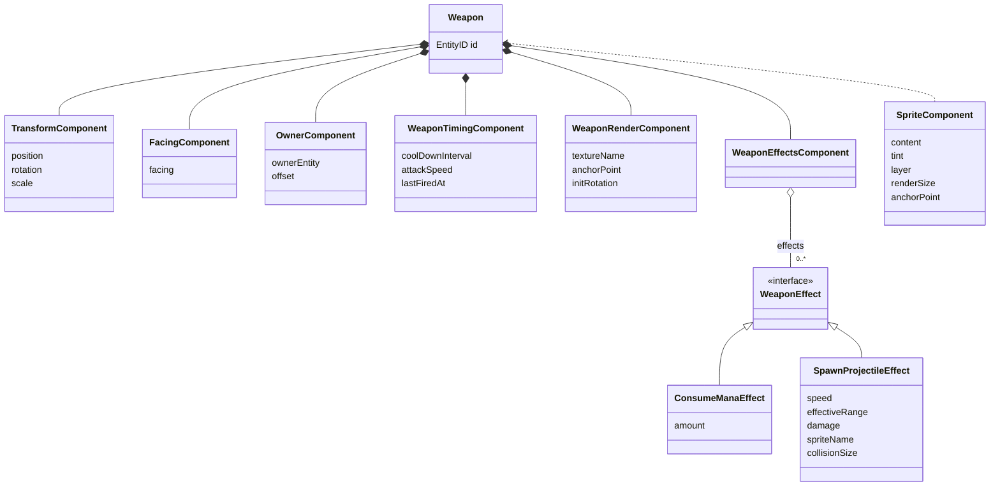

## Diagram



## Patterns

### Command pattern
Encapsulate a request as an object, allowing queueing, validation, cancellation, and replay independently of execution.

> Used in `FireCommand`,`ReloadCommand`, ..., `CommandQueue`, `CommandValidationSystem`, `CancelCommand`, `CommandQueues`

`CommandQueues` store all `CommandQueue` instances, which are queues of one specific typed `Command` structs (e.g. `FireCommand`, `ReloadCommand`).

We plan to have the following commands for player actions:
| Command | Description |
|---|---|
| `FireCommand` | Emitted on trigger pull. FiringSystem is the primary consumer. BurstFireComponent generates synthetic FireCommands for subsequent shots within a burst. |
| `ReloadCommand` | Triggers the reload in ReloadSystem. Auto-emitted by ResourceSystem when ammo hits 0 if auto-reload is enabled. |
| `SwitchWeaponCommand` | Swaps active weapon slot. SwitchWeaponSystem cancels in-flight bursts and enforces per-slot cooldowns. |
| `CancelCommand` | Cancels a pending command before it is consumed. Useful for interrupting reloads on dodge roll. |
| `AimCommand` | Updates aim direction, stored in AimStateComponent. Read by FiringSystem at fire time. |

See  for a visual of how these commands flow through the systems and also the event bus as below.

Every player or AI action (`Command`) becomes a typed struct pushed onto the `CommandQueue` of its own. This decouples the input layer from the execution layer completely. e.g. the AI does not call FiringSystem.fire(), it pushes a FireCommand. 

CommandValidationSystem acts as the guard, so no execution system ever needs to check ammo, mana, or cooldowns itself. 

CancelCommand lets you abort queued actions (e.g. cancel a reload on dodge roll) without touching the reload state machine. We use similar concept as `Optional` in Java to mark a command as cancelled without removing it from the queue, so the state machine can still see the cancelled command and reset to idle instead of trying to execute it and failing due to missing resources.

The process for adding a new command:
1. Define the command struct that adapts to `Command` protocol
2. Find the producer of the command (e.g. player input, AI decision, or an existing system) and make it push the command onto `CommandQueue` in update loop
3. Create a new system that consumes the command.
4. Register the command into `CommandQueues` in `GameScene`
    ```swift
    commandQueues.register(SwitchWeaponCommand.self)
    commandQueues.register(MoveCommand.self)
    ```

### Observer pattern

> Used in `EventBus`, `ProjectileFiredEvent`, `DamageAppliedEvent`, ...

We have Event Bus to handle one-to-many dependency so systems never call each other directly. 

e.g. FiringSystem publishes ProjectileFiredEvent; ResourceSystem, AnimSystem, and AudioSystem all subscribe independently. 

Adding a new subscriber (e.g. AchievementSystem listening for WeaponBrokenEvent) requires zero changes to existing systems.

## Modules

### Projectile

### Weapon

Why WeaponRenderer exists: SpriteComponent can be removed when hiding secondary weapon. On switch, you need a stable place to recover which texture to restore. WeaponEffectsComponent/WeaponTimingComponent should not carry render data.

## How to add a new weapon type

In current design, we plan to support weapons in categories below:
| Category | Description | Examples |
|---|---|---|
| Gun | ranged weapon that fires projectiles. | handgun, sniper |
| Melee | close combat weapon that applies damage directly. | sword |
| Launcher | ranged weapon that fires projectiles with splash damage and trajectory projectile | bazooka |
| Throwable | one-time use weapon that can be thrown. | molotov cocktail |
| Laser gun | ranged weapon that fires instant hit scan projectiles. | laser rifle |

To add a new weapon type, you need to:
1. Think about what behavior should this weapon have when it is "fired". (here we define "fired" as a general term which is triggered when `ownerInput.isShooting` and `isReadyToFire(gameTime: gameTime, timing: timing)` are both true)
   - as an example, a shotgun should fire projectile (modeled as `SpawnProjectileEffect`) and consume mana (modeled as `ConsumeManaEffect`).
   - as another example, a sword should swing, apply damage to target in range (`MeleeDamageEffect`) and consume stamina (`ConsumeStaminaEffect`).
2. If the behavior can be achieved by existing `Effect`s, simply add those effects to the weapon's `WeaponEffectsComponent`.
3. If the behavior cannot be achieved by existing `Effect`s, create a new Effect and add it to the weapon's `WeaponEffectsComponent`.
4. If you feel the need to store additional data for this weapon type, create a new Component and add it to the weapon entity. 
   - as an example, since sword need to swing, we can create a `WeaponSwingComponent` to control the animation of the swing. This component will be added to all weapon entity that can swing (e.g. sword, axe, but not gun or bow).

### How firing works

#### What is WeaponEffect?
WeaponEffect is a protocol that defines the behavior of a weapon when it is fired. 

It has a single method `apply(context: FireContext) -> FireEffectResult` that takes in a `FireContext` and returns a `FireEffectResult`.

`FireContext` contains general info about the action, including weapon, owner, firing direction and firing position. (note we intended separate firing position from weapon position or owner posotion considering some weapon can fire from a different position other than the owner position, e.g. a turret or a trap)

`FireEffectResult` is an enum that can be either `.success`, `.blocked(String)`. This is to indicate whther the pipeline is successful or blocked by some effect.

When a FireCommand is consumed by FiringSystem, it will first check if the weapon is ready to fire (e.g. not on cooldown, has enough ammo/mana/stamina, etc). If it is ready, it will create a `FireContext` and apply all effects in `WeaponEffectsComponent` sequentially.

```swift
    for effect in effectsComponent.effects {
        let result = effect.apply(context: fireContext)
        if case .blocked = result {
            blocked = true
            break
        }
    }
```

I hope user will find this design quite configurable and flexible. For example, since we already have handgun, it will be very easy to create other gun type like sniper or assault rifle by simply reusing the projectile spawning effect and just tweaking the parameters (e.g. damage, projectile speed, fire rate, etc).

For example, let's say we want to create a Rifle AK-47, we can modify argument to `WeaponEntityFactory`

```swift
    // handgun
    let handgun = WeaponEntityFactory(
        player: player,
        textureName: "handgun",
        offset: weaponOffset,
        scale: scale,
        lastFiredAt: 0,
        coolDownIntervel: TimeInterval(0.2),
        attackSpeed: 1,
        effects: [
            ConsumeManaEffect(amount: 5),
            SpawnProjectileEffect(
                speed: 300, effectiveRange: 400,
                damage: 15, spriteName: "normalHandgunBullet",
                collisionSize: SIMD2<Float>(6, 6))
        ],
        anchorPoint: nil,
        initRotation: nil
    ).make(in: world)
    // AK-47
    let ak47 = WeaponEntityFactory(
        player: player,
        textureName: "ak47",
        offset: weaponOffset,
        scale: scale,
        lastFiredAt: 0,
        coolDownIntervel: TimeInterval(0.1),
        attackSpeed: 1,
        effects: [
            ConsumeManaEffect(amount: 5),
            SpawnProjectileEffect(
                speed: 400, effectiveRange: 400,
                damage: 20, spriteName: "normalAK47Bullet",
                collisionSize: SIMD2<Float>(6, 6))
        ],
        anchorPoint: nil,
        initRotation: nil
    ).make(in: world)
```

Interpretation of some existing configurable parameters:

- `textureName`: The name of the texture to be used for the **weapon** sprite.
- `offset`: The position offset of the weapon sprite relative to the owner (player or enemy).
- `scale`: The scale of the weapon sprite (dependent on the texture).
- `lastFiredAt`: The **absolute** timestamp of the last time the weapon was fired, used for cooldown calculation. See [Cooldown](#cooldown) below for more details.
- `coolDownInterval`: The time interval between two consecutive shots. See [Cooldown](#cooldown) below for more details.
- `attackSpeed`: A multiplier that can be used by effects to modify the firing behavior. For example, it can be used to increase the speed of projectile or reduce the cooldown time if needed (currently not in used by 04/02/2026)
- `effects`: A list of effects that will be applied when the weapon is fired. See [Effects Section](#what-is-weaponeffect) above for more details.
- `anchorPoint`: The anchor point of the weapon sprite, which determines the rotation point. If nil, it will default to the center of the sprite as (0.5, 0.5). We need this parameter because some weapon sprite may need to rotate around a different point other than the center, e.g. a sword may need to have anchor point at the handle instead of the center of the sprite to achieve better visual effect.
- `initRotation`: The initial rotation of the weapon sprite in radians. If nil, it will default to 0.

In side `effects`, there is more to configure depending on the type of effect you include

For example, `ConsumeManaEffect` need the amount of mana to consume for each shot

`SpawnProjectileEffect` need the speed of projectile, effective range of projectile, damage of projectile, sprite name of projectile and collision size of the projectile to be spawned.

As an example, if you use `knight` as the `spriteName` in `SpawnProjectileEffect`, you will get a gun that fire knight (although kinda insane).

### Cooldown:
```swift
    private func isReadyToFire(gameTime: Float, timing: WeaponTimingComponent) -> Bool {
        guard let cooldown = timing.coolDownInterval else { return true }
        return (gameTime - timing.lastFiredAt) >= Float(cooldown)
    }
```
